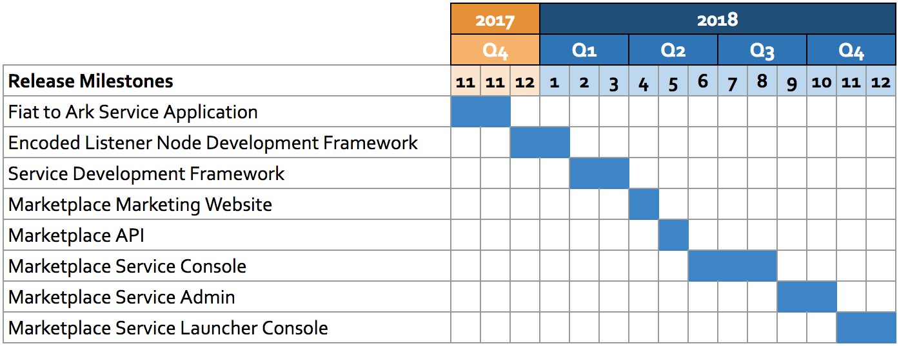

# Vision

Create a blockchain service marketplace platform that allows users to consume 
blockchain services offered by a decentralized collection of service providers. 

# Opportunity

Many entities in the blockchain space are trying to deliver some form of blockchain 
interoperability. Thus far most approaches have been using side-chain transaction
protocols that operate within a single blockchain ecosystem.

While this approach some very useful features, such as being able to perform
"trustless" and verifiable transactions across blockchains, it requires blockchains
to agree on an implement a common protocol:

- Polkadot
- district0x
- Ark SmartBridge Clone-able Sidechains
- Segwit Atomic Swaps

We expect that such technology will take a long time to get out of the "experimental"
phase and achieve any kind of mass adoption across blockchains. Even so, it is very
unlikely that any such protocol will be supported by all blockchains.

The ACES platform solves the interoperability problem using off-chain "Encoded Listener
Services" that coordinate transactions between different blockchains. We have shown the 
viability of such an approach by integrating Ark and Ethereum in the first ever 
Encoded Listener implementation.

Now the ACES team wants to scale this technology by delivering a Service Marketplace
for deploying and consuming blockchain interoperability services. Such a marketplace
would allow users of Ark to:

- Utilize functionality of any blockchain
- Implement interoperability services and deploy to a public marketplace
- Fund development with Marketplace Service fees

# Roadmap Timeline

## Platform Milestones

- Fiat to Ark Service Application Release
- Encoded Listener Node Development Framework Release
- Service Framework Release
- Marketplace Marketing Website Release
- Marketplace API Release
- Marketplace Service Console Release 
- Marketplace Service Admin Release
- Marketplace Service Launcher Console Release

## Product Milestones

Capability Milestones are worked on in parallel to the primary milestones:

- Ark Listener Node implementation
- ARK to ETH Transfer Service implementation
- ARK to Ethereum Contract Service implementation
- Bitcoin Listener Node implementation
- BTC to ARK Transfer Service implementation
- Formless Functions Framework
- ARK to ETH Formless Function implementation
- ARK to BTC Formless Function implementation
- Ethereum Listener Node implementation
- ETH to ARK Transfer Service implementation
- IPFS Listener Node implementation
- IPFS Upload Service implementation
- IPFS Download Service implementation

## Operation Milestones

- Deploy Fiat to Ark Service Application Database
- Deploy Fiat to Ark Service Application Web Application
- Deploy Blog Website
- Deploy Encoded Listener Framework Docs Site
- Deploy Service Framework Docs Site
- Deploy Marketplace Marketing Website
- Deploy Marketplace Database
- Deploy Marketplace Service Console
- Deploy Marketplace Service Admin
- Deploy Marketplace Service Launcher

## Marketing

- Blog launch
- Milestone announcements
- Marketplace Video

# Key Performance Indicators

Relevant KPI are tracked for each milestone to help measure adoption and success of the platform:

- Number of Encoded Listener Node implementations
- Number of Service implementations
- Number of Service instances
- Number of integrated blockchains
- Number of Website visitors
- Number of active Marketplace users
- Total Ark spent through Marketplace Service Nodes
- Marketplace application uptime
- Number of press articles by ACES team and unaffiliated parties (include Twitter/Reddit)
- 3 Month mean Ark price
- Infrastructure costs

# Product Strategy

## Encoded Listener Node Framework

Provide a framework and API specification for developing blockchain Encoded Listener Nodes. The Listener Node framework should allow outside developers to easily contribute new node types to the platform. 

Encoded Listener Nodes run a blockchain and expose a listener subscription API developed by the ACES team. The ACES team will implement 3 of these Encoded Listener Node types:

- Ark Encoded Listener Node
- Ethererum Encoded Listener Node
- Bitcoin Encoded Listener Node

### Deliverables:

- Encoded Listener Node API specification
- Encoded Listener API documentation
- Ark Encoded Listener Node Implementation
- Ethereum Encoded Listener Node Implementation
- Bitcoin Encoded Listener Node Implementation

## ACES Service Node Framework

Provide a framework for developing ACES Service Nodes. The ACES team will define a common web API protocol for services that developers must implement to be compatible with the ACES Marketplace. ACES Service Nodes can be written in any language by implementing the web service API and subscribe to Encoded Listener Nodes via an HTTP web API.

### Deliverables

- Service Node API Specification
- Service Node Developer Documentation
- Service Node Implementation for Ethereum Contract Deployment
- Service Node Implementation for Ark to Eth transfer
- Service Node implementation for Eth to Ark transfer 

## ACES Service Marketplace Console

Provide a web application for searching and consuming ACES services.

- API for registering services
- API Developer documentation
- Search index for registered Services
- Service Console Web Application
- Service Admin Web Application

